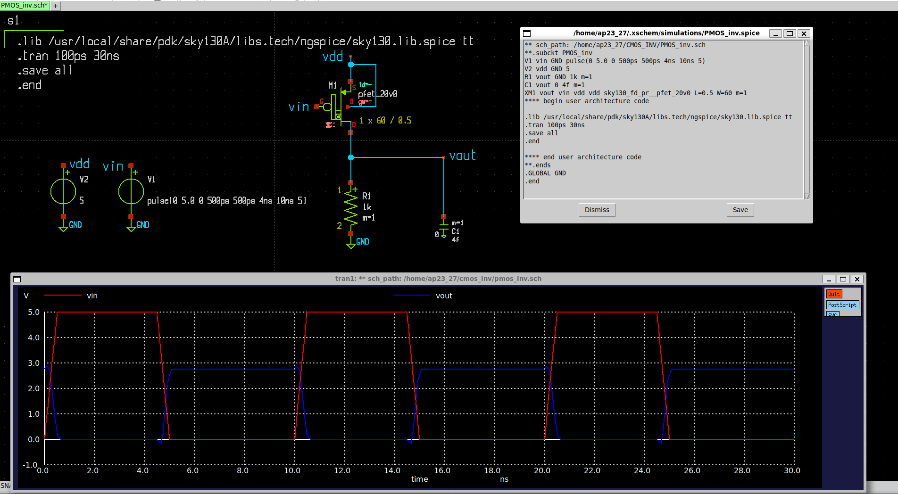
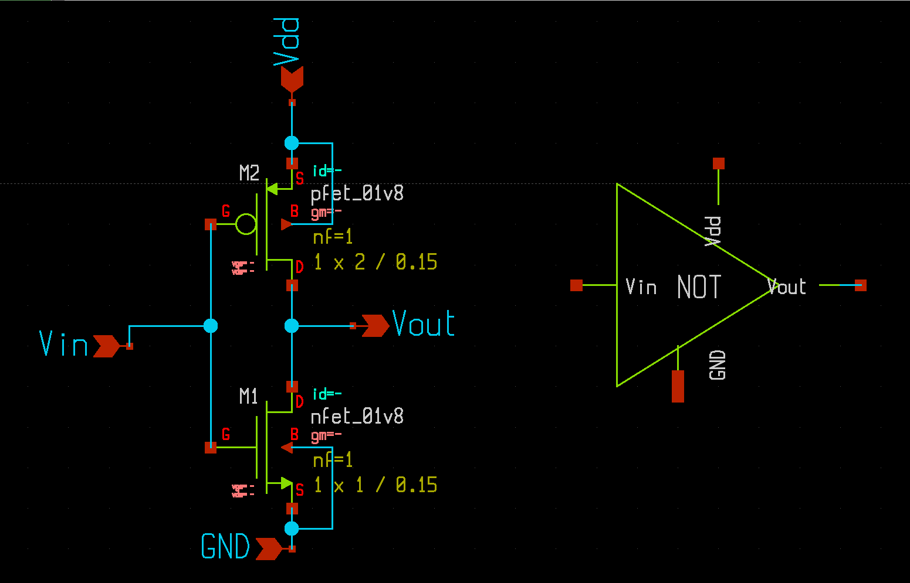
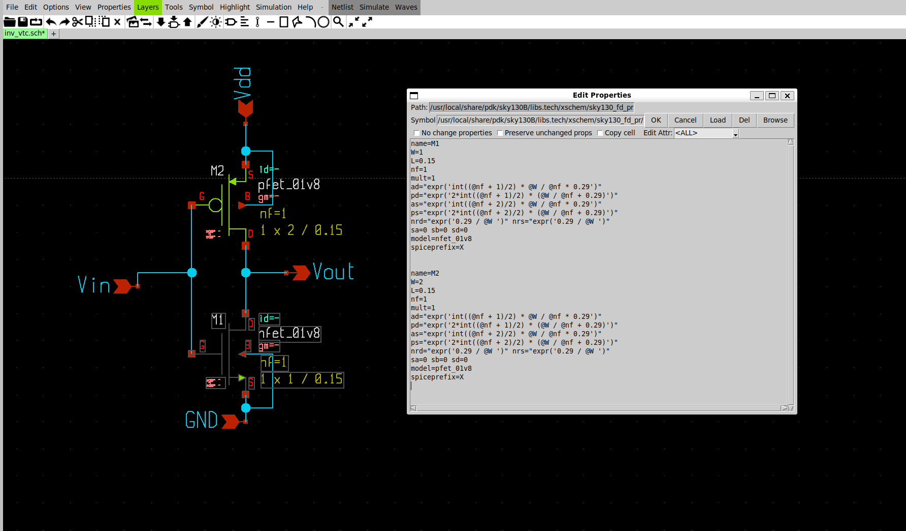
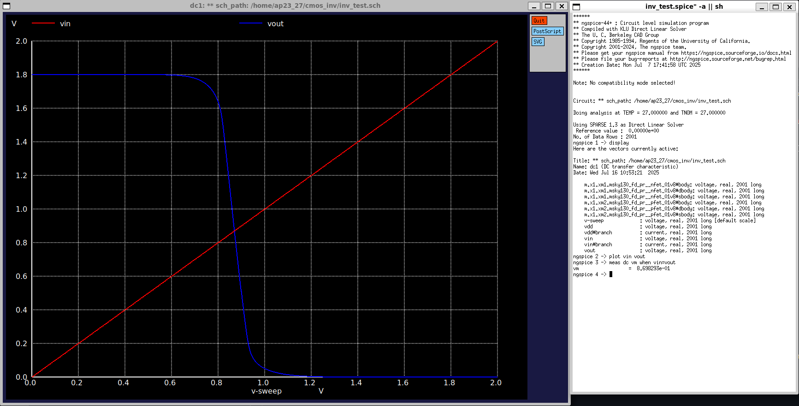

# CMOS Inverter Analysis
An inverter is a logic gate that outputs the opposite of its input.  
- Input = HIGH → Output = LOW
- Input = LOW → Output  = HIGH

CMOS stands for Complementary Metal Oxide Semiconductor. It is called Complementary because it uses two MOSFETs , which are complementary to each other i.e. when one is in ON state then other is in OFF state and vice-versa.  
Two MOSFETs are :  
- NMOS (n-channel MOSFETs)
- PMOS (p-channel MOSFTEs)

## Why use complementary MOS (CMOS) instead of only NMOS or only PMOS?  
- **Rail to Rail output** - Its ability to provide rail-to-rail output voltage levels, achieving output swings that closely match the supply rails. This ensures robust logic levels and maximizes noise margins.
- **Reduced static power consumption** - In purely NMOS or PMOS logic families, static current continuously flows through pull-up or pull-down resistors or transistors even when the circuit is not switching.  
In contrast, CMOS circuits draw negligible static current because at any steady state, either the NMOS or PMOS is off, effectively breaking the path from supply to ground.

### Why Not only NMOS ?  
Because of **Strong 0** & **Weak 1** .  
- **Strong 0** - Whenever NMOS is on , it provides a conducting path to the capacitor to discharge fully to zero through it and Hence providing a strong pull down network.  
- **Weak 1** - It cannot pass the full VDD due to the threshold voltage drop. As the output voltage approaches VDD, the gate-to-source voltage VGS drops below the threshold, causing the NMOS to turn off before reaching a full logic high.

  Figure-1 : NMOS as Inverter

### Why Not only PMOS ?  
Because of **Strong 1** & **Weak 0** . 
Just opposite to NMOS. 
- Provides a full charging path to the capacitor , resulting to strong 1 and a strong pull up network. but for logic 0, limitation of threshold voltage restricts the output to a value greater than zero. Therfore can't provide strong pul down network.

  Figure-2 : PMOS as Inverter

  

## Why CMOS ?
So to overcome these issues a combination of both NMOS & PMOS is used i.e. CMOS , where **NMOS** circuitry acts as **Pull Down N/W** and **PMOS** acts as **Pull Up N/W**.  
Since, PMOS is a Strong 1, we put it between VDD and Vout and NMOS being a STRONG 0, it is placed between Vout and GND. This way, either can act as a load to the other transistor.  
This is referred to as Complementary Metal Oxide Semiconductor(CMOS) Configuration and representing the simplest CMOS circuit known as the CMOS Inverter.

## Schematic, Simulation & Layout
### Tools Used : 
- Xschem - Schematic Capture
- NGSPICE - Spice Netlist Simulation
- Magic - Layout & DRC

## Simulation 

  Figure-3 : Inverter Symbol 

 

Here, in this schematic, a symbol is also created and named as NOT for further uses. The Design Parameters are as follows:  

  Figure-3 : Design Parameters of NMOS & PMOS

  

### DC Analysis  
DC analyis is done to plot the voltage transfer characteristics (VTC). In this Vin is swept from Low to High voltage to determine the working of circuit or we can say plot of Vout. The following plot is observed when simulated:

  Figure-3 : Voltage Transfer Characteristics (VTC) 

  

#### Trip Point (or Switching Threshold) of an Inverter  
The trip point of a CMOS inverter is the input voltage at which the output voltage switches from HIGH to LOW (or vice versa) — i.e., when both NMOS and PMOS are conducting equally.
We can also denote trip point by input voltage at which vin = vout.  
So, in the above image we can see that trip point(vm) = 0.8698V. For ideal cases , it should be around 0.9V i.e. vdd/2.  
The trip point is primarily set by the relative strengths (W/L ratios). So
