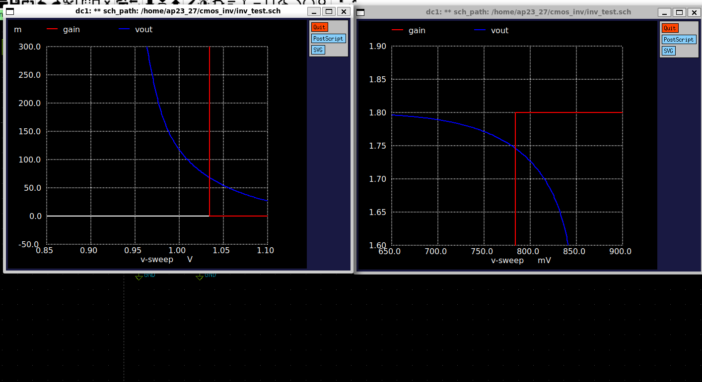

# CMOS Inverter Analysis
An inverter is a logic gate that outputs the opposite of its input.  
- Input = HIGH → Output = LOW
- Input = LOW → Output  = HIGH

CMOS stands for Complementary Metal Oxide Semiconductor. It is called Complementary because it uses two MOSFETs , which are complementary to each other i.e. when one is in ON state then other is in OFF state and vice-versa.  
Two MOSFETs are :  
- NMOS (n-channel MOSFETs)
- PMOS (p-channel MOSFTEs)

## Why use complementary MOS (CMOS) instead of only NMOS or only PMOS?  
- **Rail to Rail output** - Its ability to provide rail-to-rail output voltage levels, achieving output swings that closely match the supply rails. This ensures robust logic levels and maximizes noise margins.
- **Reduced static power consumption** - In purely NMOS or PMOS logic families, static current continuously flows through pull-up or pull-down resistors or transistors even when the circuit is not switching.  
In contrast, CMOS circuits draw negligible static current because at any steady state, either the NMOS or PMOS is off, effectively breaking the path from supply to ground.

### Why Not only NMOS ?  
Because of **Strong 0** & **Weak 1** .  
- **Strong 0** - Whenever NMOS is on , it provides a conducting path to the capacitor to discharge fully to zero through it and Hence providing a strong pull down network.  
- **Weak 1** - It cannot pass the full VDD due to the threshold voltage drop. As the output voltage approaches VDD, the gate-to-source voltage VGS drops below the threshold, causing the NMOS to turn off before reaching a full logic high.

  Figure-1 : NMOS as Inverter

### Why Not only PMOS ?  
Because of **Strong 1** & **Weak 0** . 
Just opposite to NMOS. 
- Provides a full charging path to the capacitor , resulting to strong 1 and a strong pull up network. but for logic 0, limitation of threshold voltage restricts the output to a value greater than zero. Therfore can't provide strong pul down network.

  Figure-2 : PMOS as Inverter

  

## Why CMOS ?
So to overcome these issues a combination of both NMOS & PMOS is used i.e. CMOS , where **NMOS** circuitry acts as **Pull Down N/W** and **PMOS** acts as **Pull Up N/W**.  
Since, PMOS is a Strong 1, we put it between VDD and Vout and NMOS being a STRONG 0, it is placed between Vout and GND. This way, either can act as a load to the other transistor.  
This is referred to as Complementary Metal Oxide Semiconductor(CMOS) Configuration and representing the simplest CMOS circuit known as the CMOS Inverter.

## Schematic, Simulation & Layout
### Tools Used : 
- Xschem - Schematic Capture
- NGSPICE - Spice Netlist Simulation
- Magic - Layout & DRC

## **Schematic** 

  Figure-3 : Inverter Symbol 

 

Here, in this schematic, a symbol is also created and named as NOT for further uses. The Design Parameters are as follows:  

  Figure-4 : Design Parameters of NMOS & PMOS

   

## **Simulation**
## DC Analysis  
DC analysis is a type of simulation that calculates the steady-state voltages and currents in a circuit when all inputs are constant.
It is done to plot the voltage transfer characteristics (VTC). In this Vin is swept from Low to High voltage to determine the working of circuit or we can say plot of Vout. The following plot is observed when simulated:

  Figure-5 : Voltage Transfer Characteristics (VTC) 

    

#### **Trip Point (or Switching Threshold) of an Inverter**  
- The trip point of a CMOS inverter is the input voltage at which the output voltage switches from HIGH to LOW (or vice versa) — i.e., when both NMOS and PMOS are conducting equally.We can also denote trip point by input voltage at which vin = vout.
  
So, in the above image we can see that trip point(vm) = 0.8698V. For ideal cases , it should be around 0.9V i.e. vdd/2.  
The trip point is primarily set by the relative strengths (W/L ratios). So, now analyzing the effects of (W/L) ratio of PMOS & NMOS on Trip Point.  

  
  

  

  Figure-6(a) : wp/wn , vm=0.8930V   &    Figure 6(b) : wp/wn = 4 , vm=0.905

  

So , we can say that as PMOS gets stronger (or wp/wn increases) then trip point move towards its ideal value i.e. vdd/2 .  

### Noise Margin Analysis
It is the margin (or range) for the noise to cause a fluctuation in input but there is no change in the output.  
Terms related to Noise margin:
- VIL - Maximum input voltage that can be considered as logic LOW (0).
- VIH - Minimum input voltage that can be considered as logic HIGH (1).
- VOH - Minimum voltage the inverter outputs when trying to represent logic HIGH (1).
- VOL - Maximum voltage the inverter outputs when trying to represent logic LOW (0).  

  Figure-7 : Noise Margin Analysis

   

  Figure-8 : Finding VOH and VOL 

 

Based on the above two figures, we can estimate that :

- VIL = 0.7835V
- VIH = 1.0334V
- VOH = 1.7464V
- VOL = 0.0690V

So, the two values of Noise Margin (or Noise Immunity):
- NML(Noise Margin for LOW) =  VIL - VOL = 0.7835 - 0.0690 = 0.7145V
- NMH(Noise Margin for HIGH) =  VOH - VIH = 1.7464 - 1.0334 = 0.7130V

Generally, for wp/wn = 3.5 or 4 ,Noise Margin is nearly symmetrical i.e. NML = NMH . 

## Transient Analysis  
Transient analysis is a type of simulation used to study how voltages and currents in a circuit change over time, especially during the switching or response to a change in input.  
### Delay Analysis
In this section, Four terms are widely used:  
- TPLH = Time difference between 50% of the input and 50% of the output when output goes from low to high. 
- TPHL = Time difference between 50% of the input and 50% of the output when output goes from low to high.
- Tr = time taken by output to reach 90% from 10% of its max value.
- Tf = time taken by output to reach 10% from 90% of its max value.     

  Figure-9 : Delays in an Inverter

 

  Figure-10 : Propagation Delay 

 
With reference to above diagram, we can estimate that TPLH = 0.4594 ns & TPHL = 0.3272 ns . But this propagation delay depends on the input applied , which can be a clock input or input from any other inverter. So this delay changes, if there is any change in the input.
Now, what happens to propagation delay if the rise and fall time of the input Vin changes.  

  Figure-11 : Propagation Delay When Vin is changed

 
Above Picture clearly states that TPLH & TPHL changes as there is some change in input.
TPLH = 0.4594 ns & TPHL = 0.3272 ns . As a result increasing the rise and fall time of input increases the propagation delay.  

But whenever there is a need of isolated analysis of inverter then we go with rise & fall time of output waveform instead of propagation delay.     

  Figure-12 : Rise Time & Fall Time

 
Rise time (Tr) = 0.5485 ns
Fall time (Tf) = 0.6964 ns  

### How this delay related to some other parameters:
1. **UNLOADED DELAY (CL)=0**  
Let's analyse unloaded delay first. In earlier simulation we have a load capacitance, which is generally present in a ckt, But in this case CL=0 (Unloaded Delay). Let's see when changes reflects in delay. 

  Figure-13 : Unloaded delay When Vdd = 1.8V

   

Rise time (Tr) = 37.8700 ps
Fall time (Tf) = 24.1400 ps
Here, we can see a drastic change in the delay, as the unloaded delay"<<"loaded delay. It has changed from nanosec to picosec.

2. **Changes in Power Supply**  
During initial analysis, we set the power supply to max rated voltage of inverter i.e. Vdd=1.8V. But for this case set it to 1.0V. How the delay changes is mentioned below. 

  Figure-14 : Unloaded delay When Vdd is changed to 1.0V

  

Rise time (Tr) = 54.5400 ps  
Fall time (Tf) = 39.5700 ps  
So, from above data we can conclude that as power supply increases, delay decreases (Speed of ckt increases). But increasing power supply also increases power dissipation. Hence, Delay and power dissipation are inversely related.  

3. Changes in Width of PMOS & NMOS
If width of PMOS & NMOS are changed then delay also changes. But this change is very minute in unloaded delay. As size increases Resistance of MOS decreases but at the same time internal capacitances increases which cancels out of size change. But this change is considerbale in case of loaded delay.
 

### Power Analysis
Mainly Three types of power comes into picture:
1. Dynamic Power - Occurs during switching (when the output transitions between logic levels). It isCaused by charging and discharging of load capacitance.
2. Short-Circuit Power - Occurs when both PMOS and NMOS are momentarily ON during input transition. Creates a direct path from VDD to GND.
3. Static Power - Consumed when the inverter is not switching (i.e., in steady state). Due to non-idealities in MOSFETs like Subthreshold leakage (current flows even when transistor is off), Gate oxide leakage etc.

- As gate terminal is isolated from ckt via Oxide layer, so it does not draw any current(or very minute) from input. Hence, No power delivered by the input source. All the power is delivered by the VDD source.
- For Power analysis only VDD voltage and its current i.e. VDD#branch is considered.

The plot of output voltage (Vout) and current(vdd#branch or curr_10000) through supply is as follows:  

  Figure-15 : Current and output Voltage(Vout) 

   

Power delivered by the source when CL=4 femtoF is given below.  

  Figure-15 : Power calculation at CL=4 femtoF

   

So, in this case Power = 12.6450 pW for single switching cycle. If more switching is there in the ckt then power consumption increases.

**Steps to Reduce Power Consumption**  
1. **Reducing the Power Supply** - As we can analyze that in calculation of power, supply voltage is directly multiplied to current. So, if supply reduces then power consumption also reduces.  
2. **Decreasing the Load capacitance** - In earlier case, CL=4 femtoF which gives a power consumption of 12.6450 pW for one switching cycle.
Now let's see what happens to power consumption when CL is reduced to 1 femtoF.

  Figure-16 : Power calculation at CL=1 femtoF

   
Power Consumed = 0.78886 fW
Here, we can see that power consumption reduces drastically as load capacitance decreases. This load capacitance depends on the layout of inverter. So, for relatively, lesser power consumption proper layouting of inverter should be done.  

3. **Less Switching Transitions** - An architecture should be designed in such a way that it requires less no. of switching cycles to generate a particular output.

## Layout  
For layout Magic VLSI tool is used.
Steps Of Layout:
1. **Layout of PMOS**
- Generally, the whole area is pwell (p-type), but for a PMOS substrate/body is N-type. So, firstly selecting an area and then paint with nwell.
- A smaller area is selected and painted with pdiff for drain and source.
- A polysilicon gate is created over the pdiff to separate drain and source.
- Local interconnect (li) layer is placed over the drain terminal for short connections, followed by a pdiffc layer (p diffusion contact) for connection between P diffusion layer and local interconnect. Similar thing is copied towards source layer.

2. **Layout of NMOS**
-  As the material is already P-type so no need of Pwell here.
-  Next, all the steps will be similar to the layout of PMOS. Just p will be replaced with n.

3. **Ground & VDD Connections**
- For GND and VDD connection we use P & N type substrate respectively.
- let's start with VDD connection, paint a selected area with N-type substrate over nwell.
- Now, place the li layer over it, followed by N-substrate contact for connection between N-substrate layer and local interconnect layer (li).
- In the similar fashion, GND connection is made just replacing the N with P.

4. **Interconnections**
- Connect the VDD with Source of PMOS and GND with Source of NMOS.
- Connect the Drain of Both PMOS & NMOS together.
- Extend the polysilicon layer and cover it with li layer, followed by polysilicon contact.  

5. **Labels**
- labels each connect with its name such as VDD, GND, VIN, Vout.

- Now extract the layout file to a spice file.

- **It is mandatory to clear DRC(Design Rule Check) at each step.**
